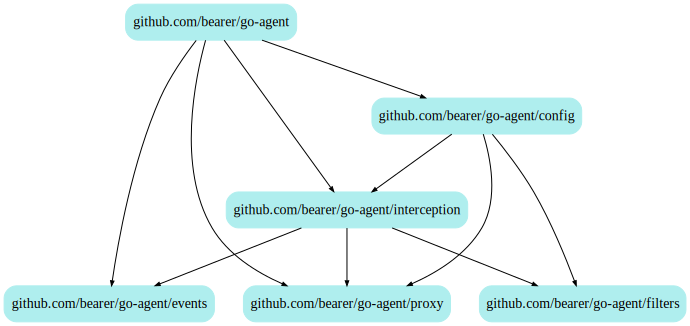

## Module layout

The Bearer agent module is made of 6 packages, in 4 layers:

- at the lowest layer are 3 standalone packages, not dependent on Bearer features
  at all, and which could eventually be published separarely:
  - _go-agent/events_ contains the event dispatcher, which is a basic code building
    block.
  - _go-agent/filters_ contains the `Matcher` types, usable with any kind of data, 
    and the `Filter` types, which apply the matchers to API calls. It is
  - _go-agent/proxy_ contains `Sender` code able to send reports to the Bearer
    platform in the background, which could actually run as a separate process.
- at layer 2 is _go-agent/interception_ which is the core of the Bearer agent,
  decorating the underlying HTTP transports with Bearer instrumentation and
  triggering report sends to the Bearer platform via the background `Sender`.
- at layer 3 is _go-agent/config_ which provides the mechanism to load config from
  various sources, including an automatic background refresh from the Bearer
  platform.
- finally, at layer 4 is the `go-agent` package, which is invoked by the client
  code, for which it will assemble a working configuration and setup the
  interception layer, and start/finish the background tasks in the 
  configuration and proxy packages.          
